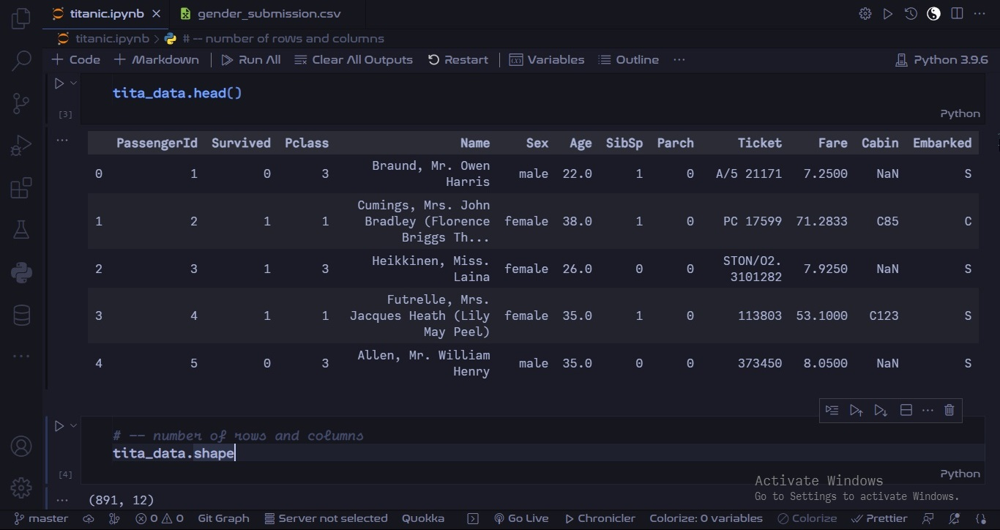
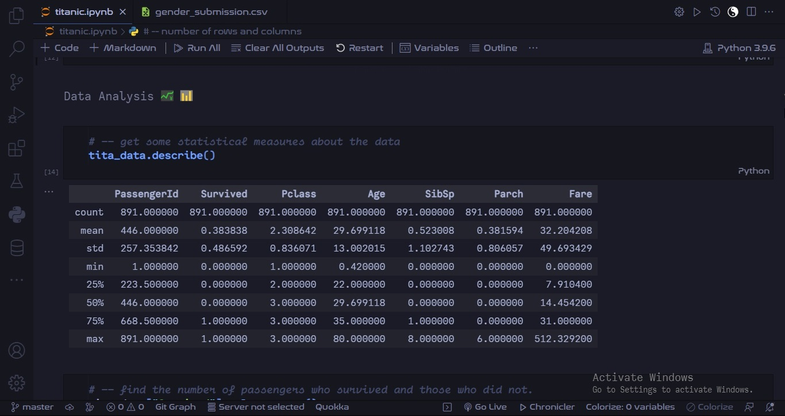
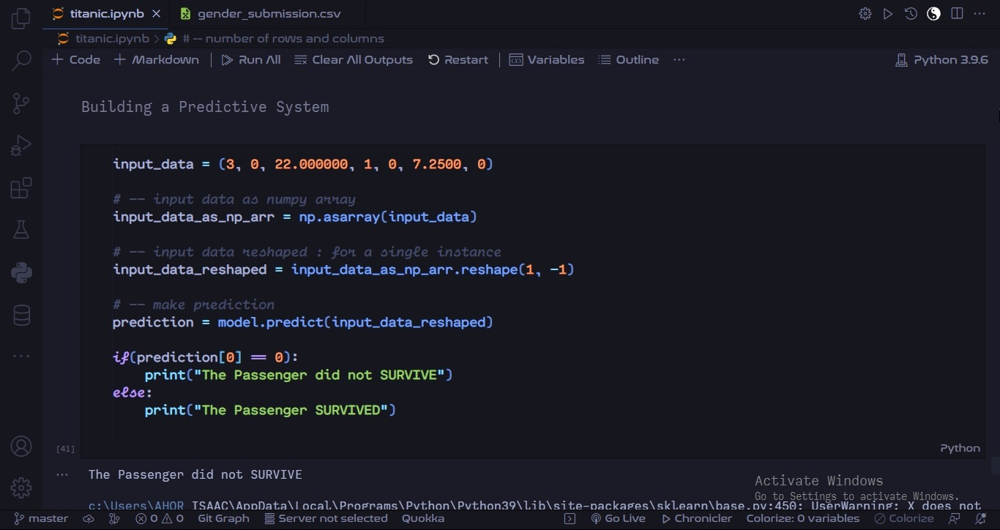

<h1 align="center">
   
  
   
  Machine Learning 🔀 How to Save Man
   
</h1>

<h2 align="center"> Titanic Survival Prediction using Machine Learning in 
     
    
</h2>

  <a href="#credits">Credits</a> •
  <a href="#support">Support</a> •
  <a href="#license">License</a>

# Setup

Follow vividly this instructions to set up  the project.

1. [VSCode Installation](#vscode-installation)
1. [Python Installation](#python-installation)
1. [Extensions Installation](#extensions-installation)
1. [Install Dependencies](#install-dependencies)
1. [Download Project](#download-project)
1. [Project Gallery](#project-gallery)

 

## VSCode Installation

- [Download VSCode](https://code.visualstudio.com/download)
- During the installation, add VSCode to path.

 

## Python Installation

- [Download Python](https://www.python.org/downloads/)
- During the installation, add Python to path.

 

## Extensions Installation

Install the following extensions on VSCode.

- Python
- Pylance
- Jupyter
- Jupyter Notebook Renderers
- GitLens

 

## Install Dependencies

Open the command line and run this command.
`pip install numpy pandas matplotlib scikit-learn seaborn`

 

## Download Project

Follow one of these ways to get this project to your computer 💻

- Download the project and extract it.
    - Right click and open the project in VSCode
    - Click on the notebook file and run all cells.
- Clone the project using the comand-line, change the _present working directory_ to the cloned project’s directory
    - Open  the project in  VSCode using the command → `code .`
    - Click on the notebook file and run all cells.

 

## Project Gallery

 

 

 

## Credits

This software uses the following open source packages:

- [Python](https://www.python.org/)
- [Numpy](https://numpy.org/)
- [Pandas](https://pandas.pydata.org/)
- [Matplotlib](https://matplotlib.org/)
- [Seaborn](https://seaborn.pydata.org/)
- [Scikit-Learn](https://scikit-learn.org/)

 

## Support

 

## You may also like...

- [ML Web App](https://github.com/AhorIsaac/ml-diabetes-pred) - A Machine Learning Web App for predicting Diabetes.
- [ML Web App](https://github.com/AhorIsaac/ml-house-price-pred) - A Machine Learning Web App for House Price Predictions. 

 

## License

MIT

---

>  Visit [Portfolio](https://his-royal-codeness.netlify.app) &nbsp;&middot;&nbsp;
>  GitHub [@AhorIsaac](https://github.com/AhorIsaac) &nbsp;&middot;&nbsp;
>  Twitter [@AhorIsaac_](https://twitter.com/AhorIsaac_)
